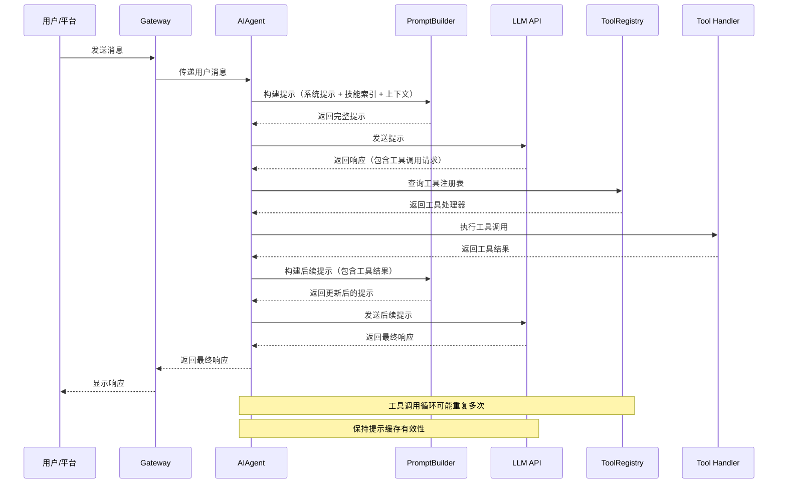
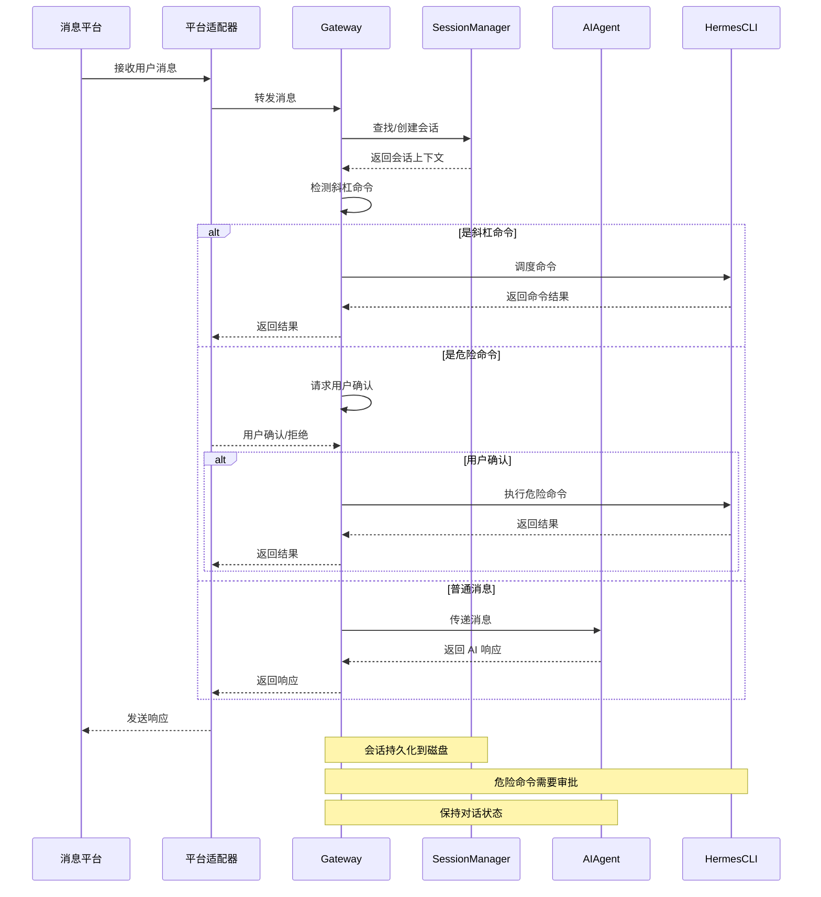
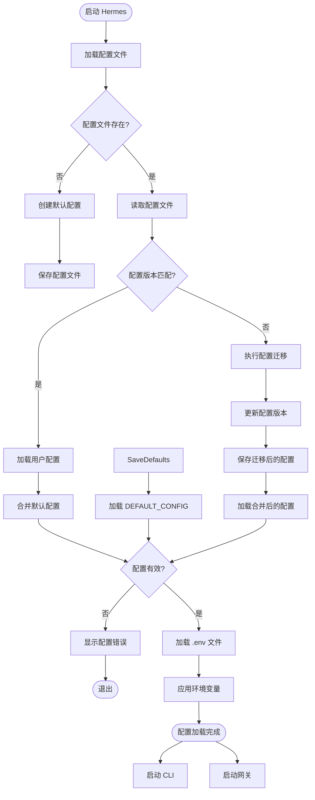
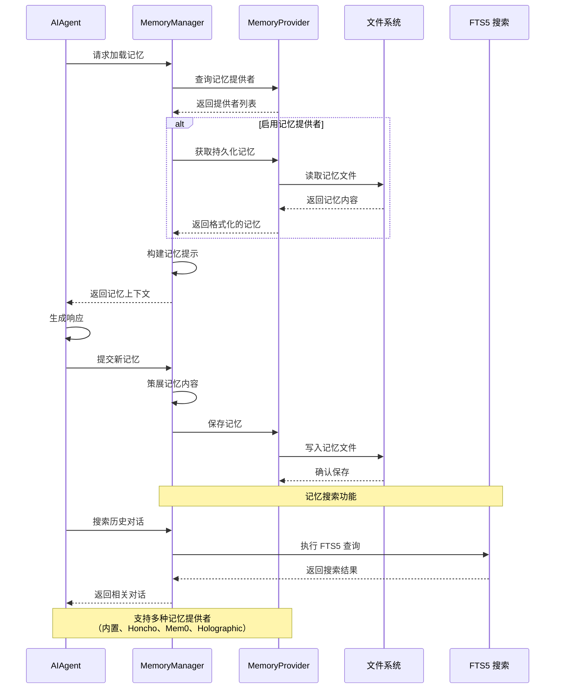
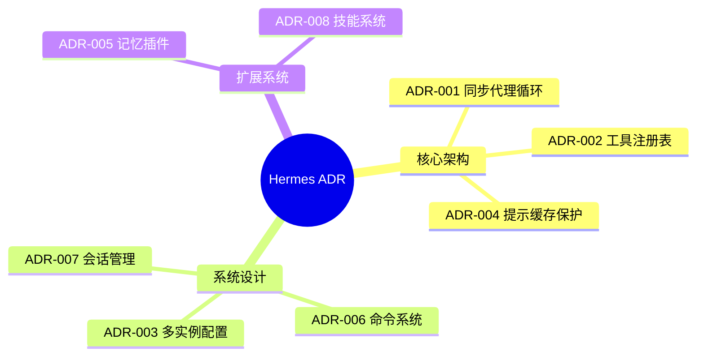

# Hermes Agent - AI 上下文文档

> 更新时间：2026-04-08 18:33:30

## 项目愿景

Hermes Agent 是一个**自我改进的 AI 代理**，由 [Nous Research](https://nousresearch.com) 构建。它是唯一具有内置学习循环的代理——能够从经验中创建技能、在使用过程中改进技能、自动持久化知识、搜索过去的对话，并跨会话建立深入的用户模型。

核心特性：
- **真正的终端界面**：完整的 TUI，支持多行编辑、斜杠命令自动补全、对话历史、中断重定向和流式工具输出
- **多平台集成**：Telegram、Discord、Slack、WhatsApp、Signal、CLI —— 单一网关进程支持所有平台
- **封闭学习循环**：代理策展记忆、定期推送、自主技能创建、技能自我改进、FTS5 会话搜索
- **定时自动化**：内置 cron 调度器，支持向任何平台传递
- **委派和并行化**：生成隔离的子代理用于并行工作流
- **随处运行**：六种终端后端（本地、Docker、SSH、Daytona、Singularity、Modal）

## 架构总览

### 技术栈
- **语言**：Python 3.11+
- **核心框架**：OpenAI SDK、Anthropic SDK
- **CLI 框架**：prompt_toolkit、Rich
- **消息平台**：python-telegram-bot、discord.py、slack-bolt、aiohttp
- **测试框架**：pytest、pytest-asyncio、pytest-xdist（~3000 测试用例）
- **依赖管理**：pyproject.toml、setuptools

### 架构模式
- **同步代理循环**：核心对话循环完全同步，简化状态管理
- **工具注册表**：中央化的工具注册系统，支持动态发现和调度
- **配置系统**：YAML 配置文件 + 环境变量，支持多实例配置
- **插件系统**：技能系统、MCP 集成、记忆提供者插件

### 设计原则
1. **提示缓存不能破坏**：整个对话过程中保持缓存有效性
2. **配置文件优先**：用户管理的配置文件优于过时的 shell 导出
3. **多实例隔离**：每个配置实例有完全独立的 HERMES_HOME 目录
4. **跨平台一致性**：CLI 和消息平台共享相同的命令注册表和工具系统

## 模块结构图

```mermaid
graph TD
    A["(根) Hermes Agent"] --> B["agent"];
    A --> C["hermes_cli"];
    A --> D["tools"];
    A --> E["gateway"];
    A --> F["environments"];
    A --> G["cron"];
    A --> H["acp_adapter"];
    A --> I["plugins"];
    A --> J["tests"];

    B --> B1["prompt_builder.py"];
    B --> B2["context_compressor.py"];
    B --> B3["memory_manager.py"];
    B --> B4["display.py"];
    B --> B5["skill_commands.py"];

    C --> C1["main.py"];
    C --> C2["config.py"];
    C --> C3["commands.py"];
    C --> C4["setup.py"];
    C --> C5["skin_engine.py"];

    D --> D1["registry.py"];
    D --> D2["terminal_tool.py"];
    D --> D3["file_tools.py"];
    D --> D4["web_tools.py"];
    D --> D5["browser_tool.py"];
    D --> D6["mcp_tool.py"];

    E --> E1["run.py"];
    E --> E2["session.py"];
    E --> E3["platforms/"];

    F --> F1["agent_loop.py"];
    F --> F2["benchmarks/"];

    click B "./agent/CLAUDE.md" "查看 agent 模块文档"
    click C "./hermes_cli/CLAUDE.md" "查看 hermes_cli 模块文档"
    click D "./tools/CLAUDE.md" "查看 tools 模块文档"
    click E "./gateway/CLAUDE.md" "查看 gateway 模块文档"
    click F "./environments/CLAUDE.md" "查看 environments 模块文档"
    click G "./cron/CLAUDE.md" "查看 cron 模块文档"
    click H "./acp_adapter/CLAUDE.md" "查看 acp_adapter 模块文档"
    click I "./plugins/CLAUDE.md" "查看 plugins 模块文档"
```



## 模块交互流程

### 工具调用流程

以下流程图展示了当 AI 模型请求调用工具时的完整交互流程：



**关键交互点**：
- **PromptBuilder** 负责组装系统提示、技能索引和用户消息
- **ToolRegistry** 提供工具的动态发现和调度
- **AIAgent** 协调整个调用流程，维护对话状态
- **工具调用** 可以是终端命令、文件操作、Web 浏览等

### 消息调度流程

以下流程图展示了从消息平台到 AI 代理的消息调度流程：



**关键交互点**：
- **平台适配器** 处理不同消息平台的协议差异
- **SessionManager** 管理会话状态和持久化
- **Gateway** 负责命令检测和调度
- **危险命令**（如删除文件）需要用户确认

### 配置加载流程

以下流程图展示了 Hermes Agent 的配置加载和迁移流程：



**关键交互点**：
- **配置版本控制** 确保配置结构的平滑升级
- **默认配置合并** 保证新选项的可用性
- **环境变量** 提供额外的配置灵活性
- **多实例支持** 通过不同的配置文件实现隔离

### 记忆管理流程

以下流程图展示了 Hermes Agent 的记忆管理和知识持久化流程：



**关键交互点**：
- **MemoryManager** 协调不同记忆提供者的交互
- **记忆策展** 智能选择和格式化记忆内容
- **FTS5 搜索** 提供快速的全文搜索能力
- **插件系统** 支持多种第三方记忆提供者

## 模块索引

| 模块名称 | 路径 | 主要职责 | 入口文件 | 测试覆盖 | 文档状态 |
|---------|------|---------|---------|---------|---------|
| **Agent Core** | `agent/` | 代理核心逻辑 | `__init__.py` | ✅ 高 | ✅ 已完成 |
| **CLI Interface** | `hermes_cli/` | 命令行界面 | `main.py` | ✅ 高 | ✅ 已完成 |
| **Tools System** | `tools/` | 工具注册与执行 | `registry.py` | ✅ 高 | ✅ 已完成 |
| **Gateway** | `gateway/` | 消息平台网关 | `run.py` | ✅ 高 | ✅ 已完成 |
| **Environments** | `environments/` | RL 训练环境 | `agent_loop.py` | ✅ 中 | ✅ 已完成 |
| **Cron Scheduler** | `cron/` | 定时任务调度 | `scheduler.py` | ✅ 高 | ✅ 已完成 |
| **ACP Adapter** | `acp_adapter/` | ACP 协议适配器 | `entry.py` | ✅ 高 | ✅ 已完成 |
| **Plugins** | `plugins/` | 记忆提供者插件 | `__init__.py` | ✅ 中 | ✅ 已完成 |
| **Tests** | `tests/` | 测试套件 | `conftest.py` | N/A | ✅ 已完成 |

## 架构决策记录（ADR）

Hermes Agent 使用架构决策记录（ADR）来记录重要的架构决策和设计选择。这些文档提供了架构决策的可追溯性，帮助理解设计理念和权衡。

### ADR 导航图

以下思维导图展示了 Hermes Agent 的所有架构决策及其关系：



### ADR 索引

| ID | 决策标题 | 状态 | 核心内容 | 图表 |
|----|---------|------|---------|------|
| [ADR-001](docs/adr/001-sync-agent-loop.md) | 同步代理循环 | ✅ 接受 | 同步 vs 异步的核心循环设计 | ✅ 架构图 |
| [ADR-002](docs/adr/002-tool-registry.md) | 工具注册表 | ✅ 接受 | 中央化工具管理系统 | ✅ 架构图 |
| [ADR-003](docs/adr/003-multi-instance.md) | 多实例配置隔离 | ✅ 接受 | 支持多个隔离的 Hermes 实例 | ✅ 结构图 |
| [ADR-004](docs/adr/004-prompt-cache.md) | 提示缓存保护 | ✅ 接受 | 保护 API 提示缓存的设计原则 | ❌ |
| [ADR-005](docs/adr/005-plugin-memory.md) | 记忆插件系统 | ✅ 接受 | 可扩展的记忆存储架构 | ✅ 架构图 |
| [ADR-006](docs/adr/006-command-system.md) | 命令系统设计 | ✅ 接受 | 跨平台命令注册和调度 | ✅ 流程图 x2 |
| [ADR-007](docs/adr/007-session-management.md) | 会话管理系统 | ✅ 接受 | 跨平台会话持久化 | ✅ 状态图 x2 |
| [ADR-008](docs/adr/008-skill-system.md) | 技能系统架构 | ✅ 接受 | 自动创建和改进技能 | ✅ 状态图 x2 |

### ADR 反馈机制

我们重视社区对架构决策的反馈。您可以通过以下方式参与：

#### 投票和评分

对 ADR 的反馈：
- 👍 **赞成**：同意此架构决策
- 👎 **反对**：不同意此架构决策
- 💡 **建议**：有改进建议

**如何反馈**：
1. 在 [GitHub Discussions](https://github.com/NousResearch/hermes-agent/discussions) 中创建讨论
2. 使用 ADR 编号作为标题前缀（如：`[ADR-001] 关于同步循环的讨论`）
3. 说明您的观点、理由或建议

#### 提交新 ADR

如果您认为需要新的架构决策记录：
1. 使用 `docs/adr/README.md` 中的模板创建新 ADR
2. 编号递增（如：ADR-009）
3. 提交 PR 并说明决策背景
4. 等待团队审查和批准

#### 修改现有 ADR

如果您认为某个 ADR 需要更新：
1. 在 GitHub 中创建 Issue 说明更新原因
2. 团队讨论并达成共识
3. 提交 PR 更新 ADR
4. 在 `docs/adr/CHANGELOG.md` 中记录变更

### ADR 资源

- 📋 [ADR 索引](docs/adr/README.md) - 完整的 ADR 列表和模板
- 📜 [ADR 变更日志](docs/adr/CHANGELOG.md) - 架构决策的演进历史
- 🔗 [ADR 规范](https://adr.github.io/) - ADR 标准规范

## 运行与开发

### 快速开始
```bash
# 安装
curl -fsSL https://raw.githubusercontent.com/NousResearch/hermes-agent/main/scripts/install.sh | bash
source ~/.bashrc

# 启动交互式 CLI
hermes

# 配置模型
hermes model

# 启动消息网关
hermes gateway
```

### 开发环境设置
```bash
# 克隆仓库
git clone https://github.com/NousResearch/hermes-agent.git
cd hermes-agent

# 安装依赖
curl -LsSf https://astral.sh/uv/install.sh | sh
uv venv venv --python 3.11
source venv/bin/activate
uv pip install -e ".[all,dev]"

# 运行测试
python -m pytest tests/ -q
```

### 核心命令
- `hermes` - 启动交互式 CLI
- `hermes model` - 选择 LLM 提供商和模型
- `hermes tools` - 配置启用的工具
- `hermes config set` - 设置配置值
- `hermes gateway` - 启动消息网关
- `hermes setup` - 运行完整设置向导
- `hermes doctor` - 诊断问题

## 测试策略

### 测试组织
- **单元测试**：每个模块都有对应的测试目录
- **集成测试**：`tests/integration/` - 需要外部服务的测试
- **E2E 测试**：`tests/e2e/` - 端到端场景测试
- **性能测试**：`tests/benchmarks/` - 基准测试

### 测试标记
- `integration` - 需要外部服务（API 密钥、Modal 等）
- 默认运行：`pytest -m 'not integration' -n auto`
- 完整测试：`pytest tests/ -q`（约 3000 测试，约 3 分钟）

### 关键测试领域
- **工具系统**：工具注册、调度、可用性检查
- **CLI 配置**：配置加载、迁移、多实例
- **网关**：平台适配器、会话持久化、命令调度
- **代理循环**：工具调用循环、错误处理、状态管理

## 编码规范

### 代码风格
- **PEP 8**：Python 代码风格指南
- **类型提示**：所有公共 API 必须有类型注解
- **文档字符串**：Google 风格的 docstrings
- **命名约定**：
  - 模块：`snake_case`
  - 类：`PascalCase`
  - 函数/变量：`snake_case`
  - 常量：`UPPER_SNAKE_CASE`

### 关键约定
1. **多实例安全**：使用 `get_hermes_home()` 而不是硬编码 `~/.hermes`
2. **用户友好路径**：使用 `display_hermes_home()` 显示路径
3. **工具注册**：所有工具必须在模块导入时注册到中央注册表
4. **命令注册**：所有斜杠命令在 `hermes_cli/commands.py` 的 `COMMAND_REGISTRY` 中定义
5. **配置版本**：更改配置结构时必须增加 `_config_version`

### 禁止模式
- ❌ 不要硬编码 `~/.hermes` 路径
- ❌ 不要在工具模式描述中硬编码跨工具引用
- ❌ 不要在 spinner/display 代码中使用 `\033[K`
- ❌ 不要在测试中写入 `~/.hermes/`
- ❌ 不要在对话过程中更改工具集
- ❌ 不要在对话过程中重新加载记忆

## AI 使用指引

### 架构理解
1. **代理循环**：`run_agent.py` 中的 `AIAgent.run_conversation()` 是核心同步循环
2. **工具系统**：`tools/registry.py` 是中央工具注册表，所有工具在导入时注册
3. **命令系统**：`hermes_cli/commands.py` 中的 `COMMAND_REGISTRY` 是所有斜杠命令的真实来源
4. **配置系统**：`hermes_cli/config.py` 中的 `DEFAULT_CONFIG` 定义所有配置选项

### 关键文件依赖链
```
tools/registry.py (无依赖)
    ↑
tools/*.py (每个在导入时调用 registry.register())
    ↑
model_tools.py (导入 tools/registry + 触发工具发现)
    ↑
run_agent.py, cli.py, batch_runner.py, environments/
```

### 添加新功能的步骤
**添加工具**：
1. 创建 `tools/your_tool.py`
2. 在 `model_tools.py` 的 `_discover_tools()` 中添加导入
3. 在 `toolsets.py` 中添加到相应的工具集

**添加斜杠命令**：
1. 在 `hermes_cli/commands.py` 的 `COMMAND_REGISTRY` 中添加 `CommandDef`
2. 在 `cli.py` 的 `HermesCLI.process_command()` 中添加处理器
3. 如果网关支持，在 `gateway/run.py` 中添加处理器

**添加配置选项**：
1. 在 `hermes_cli/config.py` 的 `DEFAULT_CONFIG` 中添加
2. 增加 `_config_version` 以触发迁移

### 常见任务
- **理解工具调用**：从 `model_tools.py:handle_function_call()` 开始
- **理解提示构建**：从 `agent/prompt_builder.py` 开始
- **理解 CLI 命令**：从 `hermes_cli/commands.py:COMMAND_REGISTRY` 开始
- **理解网关消息流**：从 `gateway/run.py:dispatch_message()` 开始
- **理解配置加载**：从 `hermes_cli/config.py:load_cli_config()` 开始

### 调试技巧
- **启用详细日志**：设置 `HERMES_DEBUG=1`
- **检查工具可用性**：`hermes tools` 命令
- **查看配置**：`hermes config show`
- **测试工具**：`pytest tests/tools/test_your_tool.py`
- **测试命令**：`pytest tests/cli/test_your_command.py`

## 相关资源

### 官方文档
- **主文档**：https://hermes-agent.nousresearch.com/docs/
- **快速开始**：https://hermes-agent.nousresearch.com/docs/getting-started/quickstart
- **架构指南**：https://hermes-agent.nousresearch.com/docs/developer-guide/architecture
- **贡献指南**：https://hermes-agent.nousresearch.com/docs/developer-guide/contributing

### 社区
- **Discord**：https://discord.gg/NousResearch
- **GitHub Issues**：https://github.com/NousResearch/hermes-agent/issues
- **Discussions**：https://github.com/NousResearch/hermes-agent/discussions
- **Skills Hub**：https://agentskills.io

### 依赖项目
- **OpenClaw**：Hermes 的前身，支持迁移导入
- **Honcho**：用于用户建模的对话式记忆系统
- **Atropos**：RL 训练环境（可选）
- **Tinker**：RL 工具集成（可选）

## 变更记录 (Changelog)

### 2026-04-08 18:33:30 - 完善 ADR 体系 📋
- ✅ **新增 3 个 ADR**：命令系统、会话管理、技能系统
- 📊 **添加视觉化图表**：为所有 ADR 添加 10 个 Mermaid 图表
- 🗺️ **创建 ADR 导航图**：在根 CLAUDE.md 中添加 ADR 索引和思维导图
- 🔄 **建立反馈机制**：添加 ADR 投票、评分和贡献指南
- 📜 **创建变更日志**：记录 ADR 的演进历史和未来计划

### 2026-04-08 18:29:30 - 添加模块交互流程图 🎨

### 2026-04-08 18:28:35 - 模块文档完成 🎉
- ✅ **创建所有模块文档**：为 8 个核心模块创建完整的 CLAUDE.md
- 📊 **文档覆盖率 100%**：所有核心模块都有详细文档
- 🔧 **面包屑导航**：每个模块文档都包含面包屑导航
- 📖 **接口文档**：详细的接口说明和使用示例
- 🎯 **索引更新**：更新索引文件反映当前文档状态
- 📈 **下一步建议**：创建测试套件覆盖报告和性能优化指南

### 2026-04-08 - 初始化 AI 上下文文档 🚀
- ✅ **创建根级文档**：生成项目级 CLAUDE.md
- 📊 **项目分析**：识别 9 个核心模块
- 🔧 **架构文档**：详细说明技术栈、架构模式和设计原则
- 📖 **开发指南**：提供运行、测试、编码规范和 AI 使用指引
- 🗺️ **模块索引**：创建模块结构图和索引表
- 🎯 **下一步**：需要为每个模块创建详细的 CLAUDE.md 文档

---

*提示：点击上方模块名称或 Mermaid 图表中的节点可快速跳转到对应模块的详细文档。*
