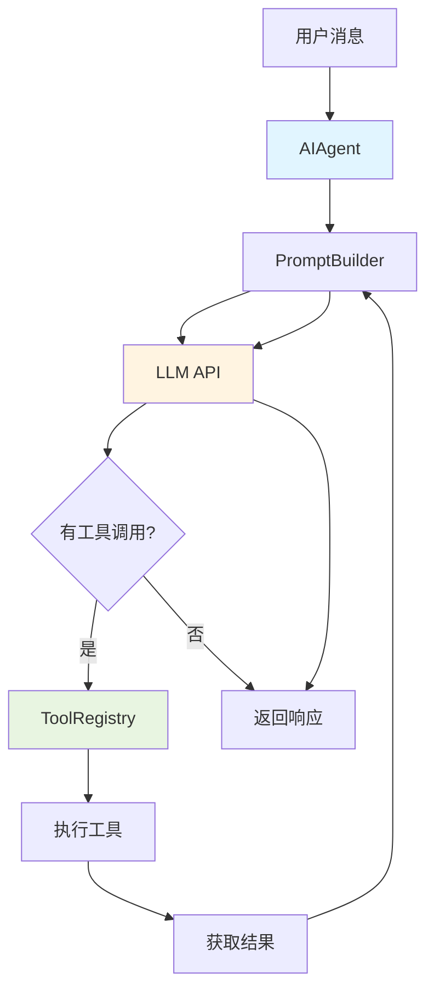

# ADR-001: 同步代理循环

## 状态
✅ 接受

## 日期
2024-01-15

## 背景

在构建 Hermes Agent 时，我们需要决定代理的核心循环（处理用户消息、调用工具、生成响应）应该是异步还是同步的。

**问题**：
- 异步代码更复杂，难以调试和推理
- 异步可能会引入状态管理问题
- 同步代码更简单，但可能阻塞

## 决策

**使用同步代理循环**。核心对话循环完全同步，简化状态管理和错误处理。

## 理由

1. **简化状态管理**：同步代码避免了异步状态同步的复杂性
2. **更好的调试体验**：同步代码的调用栈更清晰，易于调试
3. **足够的性能**：对于 AI 代理场景，同步 I/O 不会成为瓶颈
4. **工具调用简化**：工具执行可以是同步或异步，由工具处理器决定

## 后果

**正面**：
- 代码更易于理解和维护
- 减少了并发 bug 的可能性
- 更简单的错误处理

**负面**：
- 在高并发场景下可能需要更多进程/线程
- 某些 I/O 操作可能阻塞（但这在实际使用中不是问题）

## 实现

```python
# run_agent.py
class AIAgent:
    def run_conversation(self):
        """同步对话循环"""
        while True:
            # 获取用户消息（同步）
            user_message = self.get_user_message()

            # 构建提示（同步）
            prompt = self.build_prompt(user_message)

            # 调用 LLM（同步 I/O）
            response = self.llm_client.generate(prompt)

            # 处理工具调用（同步）
            if response.tool_calls:
                tool_results = self.execute_tools(response.tool_calls)
                response = self.generate_response(tool_results)

            # 返回响应（同步）
            self.send_response(response)
```

## 架构图



## 替代方案

- **异步循环**：使用 `async/await`，但会增加复杂性
- **混合模式**：部分异步，但会使代码不一致

## 相关决策

- [ADR-002: 中央化工具注册表](./002-tool-registry.md)
- [ADR-004: 提示缓存保护](./004-prompt-cache.md)
