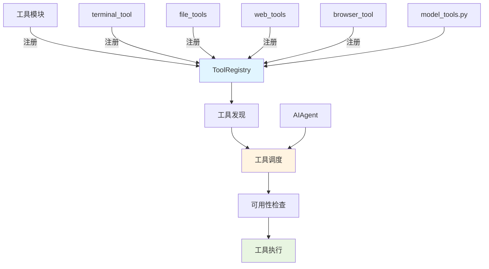

# ADR-002: 中央化工具注册表

## 状态
✅ 接受

## 日期
2024-01-20

## 背景

随着工具数量的增长，需要一个统一的机制来管理和调度工具。

**问题**：
- 工具分散在不同模块，难以统一管理
- 工具发现和调度逻辑重复
- 缺乏统一的工具可用性检查机制

## 决策

**使用中央化工具注册表**。所有工具在模块导入时注册到中央注册表，由注册表负责工具发现、调度和可用性检查。

## 理由

1. **统一管理**：所有工具元数据集中在一个地方
2. **动态发现**：工具在导入时自动注册，无需手动维护列表
3. **灵活调度**：注册表可以根据工具类型和可用性智能调度
4. **易于扩展**：添加新工具只需调用 `register()` 函数

## 后果

**正面**：
- 工具管理统一，易于维护
- 支持工具分组和标签
- 自动化的可用性检查

**负面**：
- 增加了一个中心依赖点
- 工具注册顺序可能影响行为

## 实现

```python
# tools/registry.py
class ToolRegistry:
    def __init__(self):
        self.tools: Dict[str, ToolEntry] = {}

    def register(self, tool: ToolEntry):
        """注册工具"""
        self.tools[tool.name] = tool

    def get(self, name: str) -> Optional[ToolEntry]:
        """获取工具"""
        return self.tools.get(name)

    def check_available(self, name: str) -> bool:
        """检查工具是否可用"""
        tool = self.get(name)
        if not tool:
            return False
        return tool.check_dependencies()

# 全局注册表
registry = ToolRegistry()

# tools/terminal_tool.py
from tools.registry import registry

@registry.register(
    name="terminal",
    description="Execute terminal commands",
    available=True
)
def terminal_tool(command: str) -> str:
    return subprocess.run(command, shell=True, capture_output=True).stdout
```

## 架构图



## 替代方案

- **分散式管理**：每个模块维护自己的工具列表（导致代码重复）
- **配置文件**：使用 YAML/JSON 定义工具（失去灵活性）

## 相关决策

- [ADR-001: 同步代理循环](./001-sync-agent-loop.md)
- [ADR-005: 记忆提供者插件系统](./005-plugin-memory.md)
