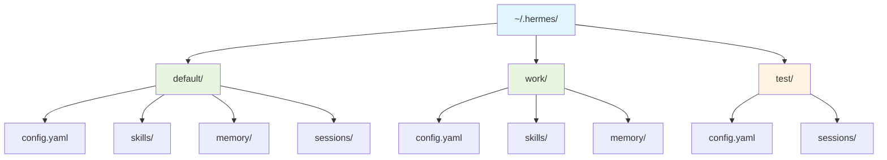

# ADR-003: 多实例配置隔离

## 状态
✅ 接受

## 日期
2024-02-01

## 背景

用户可能需要运行多个 Hermes Agent 实例（例如：个人工作、公司项目、测试环境），每个实例需要完全独立的配置和数据。

**问题**：
- 如何支持多个实例而不互相干扰？
- 如何确保每个实例有独立的数据目录？
- 如何让用户轻松切换实例？

## 决策

**使用多实例配置隔离**。每个配置实例有完全独立的 HERMES_HOME 目录，通过 `--profile` 参数或 `HERMES_PROFILE` 环境变量切换。

## 理由

1. **完全隔离**：每个实例有独立的配置、记忆、技能
2. **灵活切换**：通过参数或环境变量轻松切换
3. **数据安全**：不同实例的数据不会混淆
4. **易于测试**：可以为测试创建独立的实例

## 后果

**正面**：
- 支持多工作流隔离
- 便于创建测试环境
- 数据安全，不会混淆

**负面**：
- 需要管理多个目录
- 可能增加磁盘使用

## 实现

```python
# hermes_cli/config.py
def get_hermes_home() -> Path:
    """获取当前实例的 HERMES_HOME"""
    profile = os.environ.get("HERMES_PROFILE", "default")
    base_path = Path.home() / ".hermes"
    return base_path / profile

# 使用示例
# 默认实例
$ hermes
# 使用 ~/.hermes/default

# 工作实例
$ HERMES_PROFILE=work hermes
# 使用 ~/.hermes/work

# 测试实例
$ HERMES_PROFILE=test hermes
# 使用 ~/.hermes/test
```

## 目录结构图



## 配置文件结构

```
~/.hermes/
├── default/          # 默认实例
│   ├── config.yaml
│   ├── skills/
│   ├── memory/
│   └── sessions/
├── work/             # 工作实例
│   ├── config.yaml
│   ├── skills/
│   └── memory/
└── test/             # 测试实例
    ├── config.yaml
    └── sessions/
```

## 替代方案

- **单一实例**：所有数据在 `~/.hermes/`（无法隔离）
- **环境变量**：使用 `HERMES_HOME` 直接指定路径（不够灵活）

## 相关决策

- [ADR-004: 提示缓存保护](./004-prompt-cache.md)
