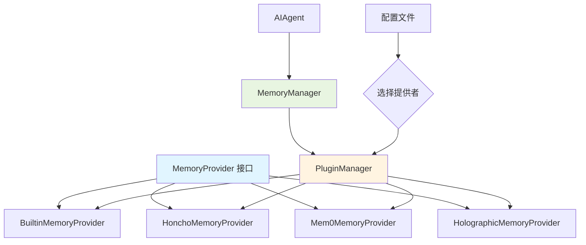

# ADR-005: 记忆提供者插件系统

## 状态
✅ 接受

## 日期
2024-03-01

## 背景

Hermes Agent 需要支持多种记忆存储和检索方式（本地文件、远程服务、向量数据库等）。用户可能希望使用第三方记忆系统（如 Honcho、Mem0）或自定义实现。

**问题**：
- 如何支持多种记忆提供者而不耦合核心代码？
- 如何让用户轻松切换或添加新的记忆提供者？
- 如何保持记忆接口的一致性？

## 决策

**使用记忆提供者插件系统**。定义标准的记忆提供者接口，支持插件式注册和发现，内置多种实现并允许第三方扩展。

## 理由

1. **解耦**：核心代码不依赖特定的记忆实现
2. **灵活性**：用户可以选择最适合的记忆系统
3. **可扩展**：第三方可以开发自定义记忆提供者
4. **向后兼容**：添加新的提供者不影响现有代码

## 后果

**正面**：
- 支持多种记忆系统（内置、Honcho、Mem0、Holographic）
- 用户可以根据需求选择
- 便于第三方集成

**负面**：
- 增加了抽象层的复杂性
- 需要维护接口一致性
- 插件管理需要额外的工作

## 实现

### 接口定义

```python
# plugins/memory/base.py
from abc import ABC, abstractmethod
from typing import List, Dict, Any

class MemoryProvider(ABC):
    """记忆提供者接口"""

    @abstractmethod
    async def add_memory(self, content: str, metadata: Dict[str, Any]) -> str:
        """添加记忆"""
        pass

    @abstractmethod
    async def search_memories(self, query: str, limit: int = 10) -> List[Dict]:
        """搜索记忆"""
        pass

    @abstractmethod
    async def get_recent_memories(self, limit: int = 10) -> List[Dict]:
        """获取最近的记忆"""
        pass

    @property
    @abstractmethod
    def name(self) -> str:
        """提供者名称"""
        pass
```

### 内置实现

```python
# plugins/memory/builtin/__init__.py
from plugins.memory.base import MemoryProvider

class BuiltinMemoryProvider(MemoryProvider):
    """内置文件系统记忆提供者"""

    def __init__(self, hermes_home: Path):
        self.memory_dir = hermes_home / "memory"
        self.memory_dir.mkdir(parents=True, exist_ok=True)

    async def add_memory(self, content: str, metadata: Dict) -> str:
        memory_id = str(uuid.uuid4())
        memory_file = self.memory_dir / f"{memory_id}.json"
        memory_file.write_text(json.dumps({
            "id": memory_id,
            "content": content,
            "metadata": metadata,
            "timestamp": datetime.now().isoformat()
        }))
        return memory_id

    async def search_memories(self, query: str, limit: int = 10) -> List[Dict]:
        # FTS5 搜索实现
        pass

    @property
    def name(self) -> str:
        return "builtin"
```

### 插件注册

```python
# plugins/__init__.py
class PluginManager:
    def __init__(self):
        self.memory_providers: Dict[str, MemoryProvider] = {}

    def register_memory_provider(self, provider: MemoryProvider):
        """注册记忆提供者"""
        self.memory_providers[provider.name] = provider

    def get_memory_provider(self, name: str) -> MemoryProvider:
        """获取记忆提供者"""
        return self.memory_providers.get(name)

# 自动注册内置提供者
manager = PluginManager()
manager.register_memory_provider(BuiltinMemoryProvider(hermes_home))
manager.register_memory_provider(HonchoMemoryProvider(api_key))
manager.register_memory_provider(Mem0MemoryProvider(api_key))
```

### 配置

```yaml
# config.yaml
memory:
  provider: "honcho"  # 或 "builtin", "mem0", "holographic"
  honcho:
    api_key: "sk-..."
  mem0:
    api_key: "memo-..."
```

## 架构图



## 替代方案

- **单一实现**：只支持一种记忆系统（缺乏灵活性）
- **硬编码切换**：用 if-else 切换不同实现（难以扩展）

## 相关决策

- [ADR-002: 中央化工具注册表](./002-tool-registry.md)
