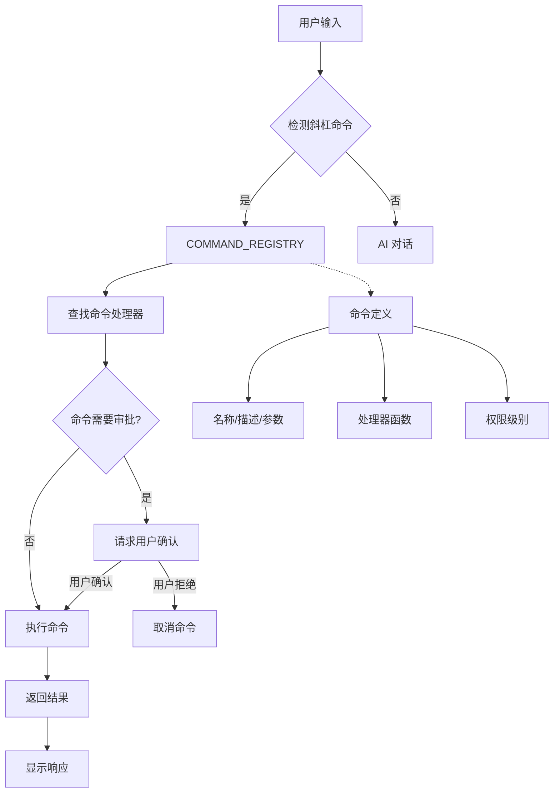
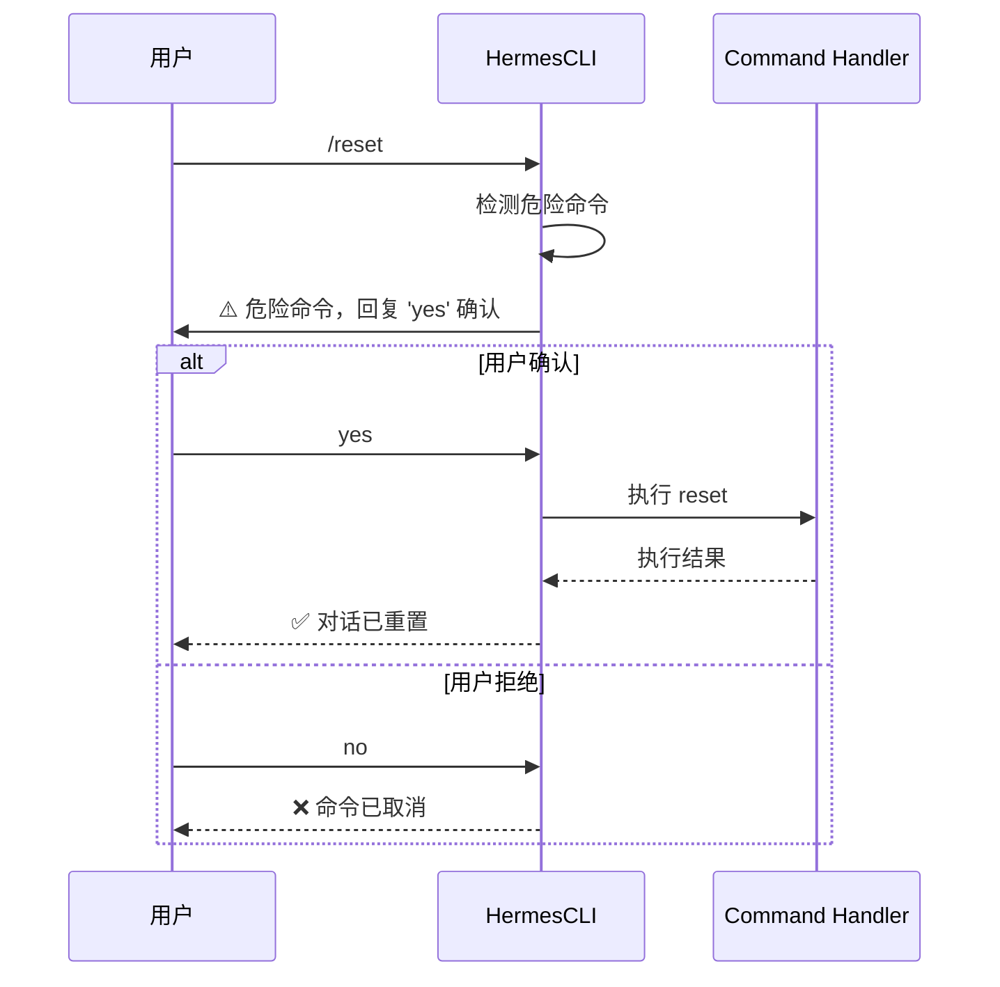

# ADR-006: 命令系统设计

## 状态
✅ 接受

## 日期
2024-03-15

## 背景

Hermes Agent 需要一个灵活的命令系统，支持 CLI 和消息平台（Telegram、Discord 等）中的斜杠命令。

**问题**：
- 如何在多个平台间保持命令的一致性？
- 如何支持命令的动态注册和发现？
- 如何处理命令参数和验证？
- 如何支持危险命令的审批流程？

## 决策

**使用中央化命令注册表**。所有命令在 `COMMAND_REGISTRY` 中定义，支持动态注册、参数验证、权限控制和跨平台调度。

## 理由

1. **统一管理**：所有命令在一个地方定义和配置
2. **跨平台一致**：CLI 和消息平台共享相同的命令逻辑
3. **类型安全**：使用 Pydantic 进行参数验证
4. **易于扩展**：添加新命令只需注册到注册表

## 后果

**正面**：
- 命令管理统一，易于维护
- 支持命令别名和分组
- 内置参数验证和类型检查
- 支持危险命令的审批流程

**负面**：
- 增加了中央注册表的复杂性
- 命令定义较为冗长

## 架构



## 实现

### 命令定义

```python
# hermes_cli/commands.py
from typing import Optional, List
from pydantic import BaseModel

class CommandDef:
    """命令定义"""
    name: str              # 命令名称
    description: str       # 命令描述
    parameters: dict       # 参数定义
    handler: callable      # 处理函数
    dangerous: bool        # 是否危险命令
    category: str          # 命令分类
    aliases: List[str]     # 命令别名

# 全局命令注册表
COMMAND_REGISTRY = {
    "model": CommandDef(
        name="model",
        description="选择 LLM 提供商和模型",
        parameters={
            "provider": {"type": "str", "description": "LLM 提供商"},
            "model": {"type": "str", "description": "模型名称"}
        },
        handler=set_model_handler,
        dangerous=False,
        category="配置"
    ),

    "reset": CommandDef(
        name="reset",
        description="重置对话（删除所有记忆）",
        parameters={},
        handler=reset_handler,
        dangerous=True,  # 危险命令，需要确认
        category="对话"
    ),

    # ... 更多命令
}
```

### 命令调度

```python
# hermes_cli/cli.py
class HermesCLI:
    def process_command(self, command_str: str):
        """处理命令字符串"""
        parts = command_str.split()
        command_name = parts[0].lstrip("/")
        args = parts[1:]

        # 查找命令
        cmd_def = COMMAND_REGISTRY.get(command_name)
        if not cmd_def:
            return f"未知命令: {command_name}"

        # 危险命令确认
        if cmd_def.dangerous and not self.confirmed_dangerous:
            self.pending_command = (cmd_def, args)
            return f"⚠️ 危险命令: {cmd_def.description}\n回复 'yes' 确认执行"

        # 执行命令
        return cmd_def.handler(*args)
```

### 参数验证

```python
from pydantic import BaseModel, ValidationError

class ModelCommandParams(BaseModel):
    provider: str
    model: Optional[str] = None

def set_model_handler(provider: str, model: str = None):
    """设置模型"""
    try:
        params = ModelCommandParams(provider=provider, model=model)
        # 执行逻辑...
    except ValidationError as e:
        return f"参数错误: {e}"
```

## 命令分类

| 分类 | 命令示例 | 说明 |
|------|---------|------|
| **配置** | `/model`, `/config`, `/tools` | 系统配置相关 |
| **对话** | `/reset`, `/clear`, `/history` | 对话管理相关 |
| **技能** | `/skill`, `/skills`, `/learn` | 技能管理相关 |
| **记忆** | `/remember`, `/forget`, `/search` | 记忆管理相关 |
| **系统** | `/doctor`, `/help`, `/version` | 系统信息和诊断 |

## 危险命令流程



## 替代方案

- **分散式命令**：每个模块处理自己的命令（不一致）
- **配置文件**：用 YAML 定义命令（失去灵活性）
- **插件系统**：命令作为插件加载（过度设计）

## 相关决策

- [ADR-001: 同步代理循环](./001-sync-agent-loop.md)
- [ADR-003: 多实例配置隔离](./003-multi-instance.md)
