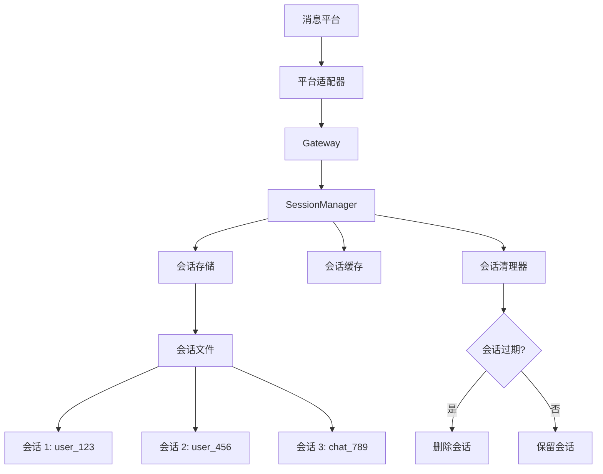
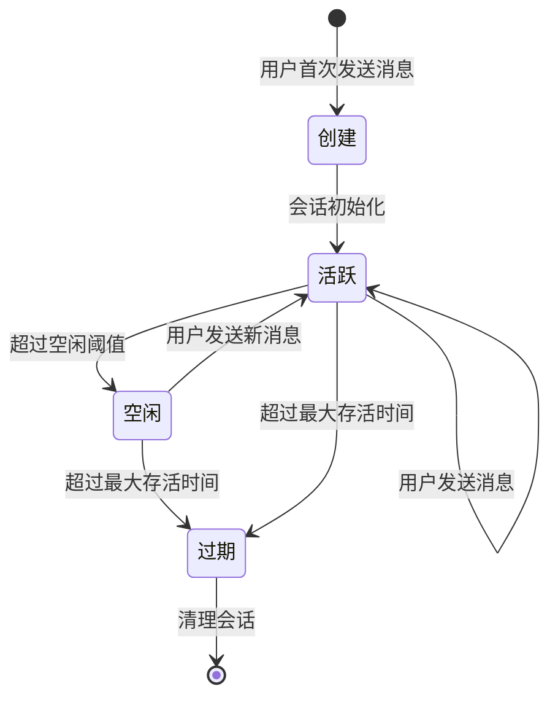

# ADR-007: 会话管理系统

## 状态
✅ 接受

## 日期
2024-03-20

## 背景

Hermes Agent 需要在多个消息平台（Telegram、Discord、Slack 等）上维护用户会话，支持跨平台的会话持久化和状态管理。

**问题**：
- 如何在不同平台间保持会话一致性？
- 如何处理会话的持久化和恢复？
- 如何支持多用户并发访问？
- 如何处理会话超时和清理？

## 决策

**使用集中式会话管理器**。所有平台共享同一个会话管理器，每个会话有唯一的 ID，会话状态持久化到磁盘。

## 理由

1. **跨平台一致**：用户在不同平台获得一致的体验
2. **状态持久化**：会话可以跨重启恢复
3. **并发支持**：支持多个用户同时使用
4. **自动清理**：自动清理过期会话

## 后果

**正面**：
- 统一的会话管理逻辑
- 支持会话恢复和历史查询
- 自动的资源清理

**负面**：
- 需要管理会话文件
- 可能增加磁盘 I/O

## 架构



## 实现

### 会话管理器

```python
# gateway/session.py
from dataclasses import dataclass
from datetime import datetime, timedelta
from typing import Dict, Optional
import json

@dataclass
class GatewaySession:
    """网关会话"""
    session_id: str              # 会话 ID
    platform: str                # 平台名称
    user_id: str                 # 用户 ID
    chat_id: str                 # 聊天 ID
    created_at: datetime         # 创建时间
    last_activity: datetime      # 最后活动时间
    messages: List[Dict]         # 消息历史
    context: Dict                # 会话上下文

    def is_expired(self, timeout: timedelta = timedelta(days=7)) -> bool:
        """检查会话是否过期"""
        return datetime.now() - self.last_activity > timeout

class SessionManager:
    """会话管理器"""

    def __init__(self, hermes_home: Path):
        self.sessions_dir = hermes_home / "sessions"
        self.sessions_dir.mkdir(parents=True, exist_ok=True)
        self.cache: Dict[str, GatewaySession] = {}

    def get_or_create(self, platform: str, user_id: str, chat_id: str) -> GatewaySession:
        """获取或创建会话"""
        session_id = f"{platform}:{user_id}:{chat_id}"

        # 检查缓存
        if session_id in self.cache:
            session = self.cache[session_id]
            session.last_activity = datetime.now()
            return session

        # 从磁盘加载
        session_file = self.sessions_dir / f"{session_id}.json"
        if session_file.exists():
            session = self._load_session(session_file)
            session.last_activity = datetime.now()
        else:
            session = GatewaySession(
                session_id=session_id,
                platform=platform,
                user_id=user_id,
                chat_id=chat_id,
                created_at=datetime.now(),
                last_activity=datetime.now(),
                messages=[],
                context={}
            )

        # 更新缓存
        self.cache[session_id] = session
        return session

    def save_session(self, session: GatewaySession):
        """保存会话"""
        session_file = self.sessions_dir / f"{session.session_id}.json"
        session_file.write_text(json.dumps({
            "session_id": session.session_id,
            "platform": session.platform,
            "user_id": session.user_id,
            "chat_id": session.chat_id,
            "created_at": session.created_at.isoformat(),
            "last_activity": session.last_activity.isoformat(),
            "messages": session.messages,
            "context": session.context
        }, indent=2))

    def cleanup_expired(self, max_age: timedelta = timedelta(days=7)):
        """清理过期会话"""
        now = datetime.now()
        for session_file in self.sessions_dir.glob("*.json"):
            try:
                data = json.loads(session_file.read_text())
                last_activity = datetime.fromisoformat(data["last_activity"])
                if now - last_activity > max_age:
                    session_file.unlink()
                    if data["session_id"] in self.cache:
                        del self.cache[data["session_id"]]
            except Exception as e:
                print(f"清理会话失败: {e}")
```

### 会话生命周期



### 会话存储结构

```
~/.hermes/sessions/
├── telegram:user123:chat456.json
├── discord:user789:chat101.json
├── slack:user234:chat345.json
└── whatsapp:user567:chat789.json
```

### 会话内容示例

```json
{
  "session_id": "telegram:user123:chat456",
  "platform": "telegram",
  "user_id": "user123",
  "chat_id": "chat456",
  "created_at": "2024-03-20T10:00:00",
  "last_activity": "2024-03-20T15:30:00",
  "messages": [
    {"role": "user", "content": "Hello", "timestamp": "..."},
    {"role": "assistant", "content": "Hi!", "timestamp": "..."}
  ],
  "context": {
    "current_model": "gpt-4",
    "tools_enabled": ["terminal", "file"],
    "pending_command": null
  }
}
```

## 会话策略

| 策略 | 默认值 | 说明 |
|------|--------|------|
| **空闲超时** | 1 小时 | 超过此时间无活动则标记为空闲 |
| **最大存活** | 7 天 | 超过此时间则删除会话 |
| **最大消息数** | 1000 | 超过则清理旧消息 |
| **消息保留** | 100 | 清理时保留最近 N 条消息 |

## 并发控制

```python
import threading

class SessionManager:
    def __init__(self, hermes_home: Path):
        self.lock = threading.RLock()
        # ...

    def get_or_create(self, platform: str, user_id: str, chat_id: str) -> GatewaySession:
        with self.lock:
            # 线程安全的会话操作
            ...
```

## 替代方案

- **内存会话**：重启丢失（不推荐）
- **数据库会话**：使用 SQLite（过度设计）
- **无状态会话**：每次都重建（无法保持上下文）

## 相关决策

- [ADR-001: 同步代理循环](./001-sync-agent-loop.md)
- [ADR-006: 命令系统设计](./006-command-system.md)
