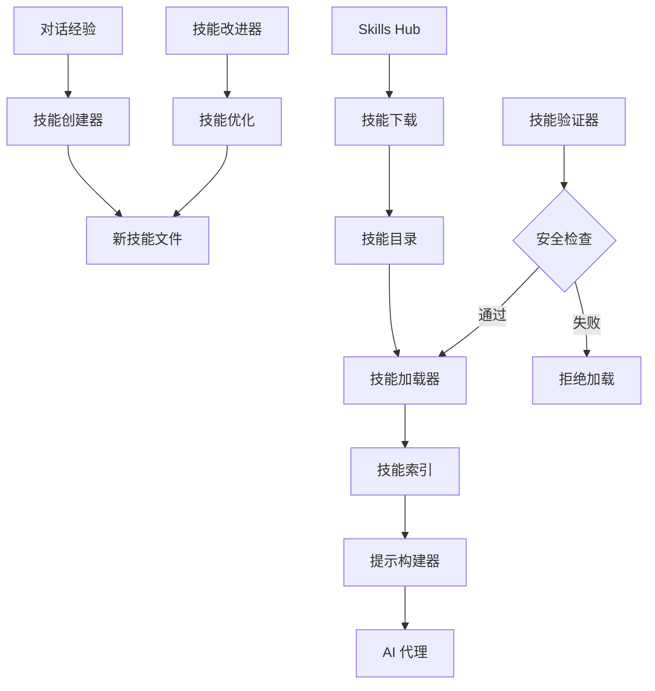
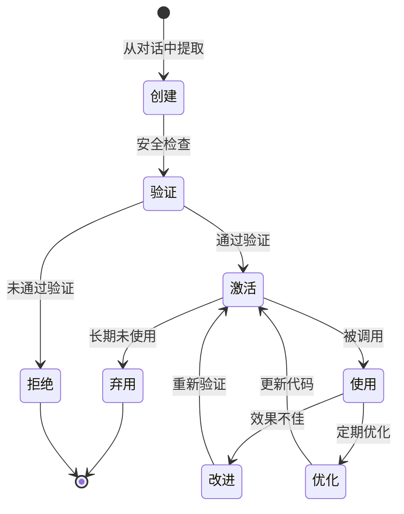

# ADR-008: 技能系统架构

## 状态
✅ 接受

## 日期
2024-04-01

## 背景

Hermes Agent 需要一个技能系统，让 AI 能够从经验中学习、创建新技能、改进现有技能，并自动持久化这些技能。

**问题**：
- 如何表示技能（代码 + 描述 + 使用场景）？
- 如何支持技能的自动创建和改进？
- 如何确保技能的质量和安全性？
- 如何支持技能的共享和发现？

## 决策

**使用基于文件的技能系统**。技能存储为 Python 文件，包含代码、元数据和使用示例。支持从对话中自动创建技能、技能自我改进、以及技能共享。

## 理由

1. **简单直观**：技能就是代码，易于理解和修改
2. **版本控制**：技能文件可以用 Git 管理
3. **动态加载**：运行时动态加载和卸载技能
4. **易于共享**：技能文件可以轻松分享

## 后果

**正面**：
- 技能易于创建和修改
- 支持技能的版本控制
- 可以通过文件系统共享技能
- 支持技能的自动改进

**负面**：
- 需要管理技能文件的加载
- 技能代码可能有安全风险
- 技能发现和搜索较困难

## 架构



## 技能文件结构

```python
# skills/my_skill.py
"""
技能名称：文件操作助手
技能描述：帮助用户执行常见的文件操作
创建时间：2024-04-01
使用次数：15
成功次数：12
"""

from typing import Dict, Any
from tools.registry import registry

def file_summary(directory: str) -> Dict[str, Any]:
    """
    生成目录摘要

    Args:
        directory: 目录路径

    Returns:
        包含文件数量、总大小等信息的字典
    """
    # 实现代码
    pass

def find_large_files(directory: str, min_size_mb: float = 10) -> list:
    """
    查找大文件

    Args:
        directory: 目录路径
        min_size_mb: 最小文件大小（MB）

    Returns:
        大文件列表
    """
    # 实现代码
    pass

# 技能元数据
SKILL_METADATA = {
    "name": "file_operations",
    "description": "文件操作助手",
    "version": "1.0.0",
    "author": "Hermes Agent",
    "tags": ["files", "utilities"],
    "dependencies": ["tools.file_tools"],
}
```

## 技能生命周期



## 技能自动创建

```python
# agent/skill_commands.py
class SkillCreator:
    def extract_skill_from_conversation(self, messages: list) -> Optional[str]:
        """
        从对话中提取技能

        分析对话模式，识别可重用的操作序列
        """
        # 1. 分析对话中的重复模式
        patterns = self.analyze_patterns(messages)

        # 2. 识别可重用的操作序列
        reusable_sequences = self.find_reusable_sequences(patterns)

        # 3. 生成技能代码
        for sequence in reusable_sequences:
            skill_code = self.generate_skill_code(sequence)

            # 4. 验证技能安全性
            if self.validate_skill(skill_code):
                self.save_skill(skill_code)

    def generate_skill_code(self, sequence: list) -> str:
        """生成技能代码"""
        # 使用 AI 生成 Python 代码
        prompt = f"""
        根据以下操作序列生成一个可重用的 Python 函数：

        {sequence}

        要求：
        1. 函数有清晰的类型注解
        2. 包含完整的文档字符串
        3. 处理错误情况
        4. 返回结构化结果
        """

        # 调用 LLM 生成代码
        code = self.llm_client.generate(prompt)
        return code
```

## 技能自我改进

```python
class SkillImprover:
    def improve_skill(self, skill_path: Path, performance_metrics: Dict):
        """
        基于性能指标改进技能

        Args:
            skill_path: 技能文件路径
            performance_metrics: 性能指标（成功率、执行时间等）
        """
        # 1. 读取当前技能代码
        skill_code = skill_path.read_text()

        # 2. 分析性能瓶颈
        if performance_metrics["success_rate"] < 0.8:
            # 成功率低，可能需要改进错误处理
            improvement_prompt = f"""
            以下技能的成功率较低（{performance_metrics['success_rate']:.1%}）。
            请改进错误处理和边界情况处理：

            {skill_code}
            """

        elif performance_metrics["avg_time"] > 5.0:
            # 执行时间过长，可能需要优化
            improvement_prompt = f"""
            以下技能的执行时间较长（{performance_metrics['avg_time']:.1f}s）。
            请优化性能：

            {skill_code}
            """

        # 3. 生成改进后的代码
        improved_code = self.llm_client.generate(improvement_prompt)

        # 4. 验证改进后的代码
        if self.validate_skill(improved_code):
            # 备份原代码
            backup_path = skill_path.with_suffix(".py.bak")
            skill_path.rename(backup_path)

            # 保存改进后的代码
            skill_path.write_text(improved_code)

            # 更新元数据
            self.update_metadata(skill_path, {"improved_at": datetime.now()})
```

## 技能验证

```python
class SkillValidator:
    def validate_skill(self, skill_code: str) -> bool:
        """
        验证技能安全性

        检查：
        1. 不包含危险操作（rm -rf / 等）
        2. 不访问敏感路径
        3. 有适当的错误处理
        4. 符合代码风格
        """
        # 1. 静态代码分析
        if self.contains_dangerous_operations(skill_code):
            return False

        # 2. AST 分析
        try:
            tree = ast.parse(skill_code)
            if self.has_unsafe_imports(tree):
                return False
        except SyntaxError:
            return False

        # 3. 沙箱执行测试
        if not self.test_in_sandbox(skill_code):
            return False

        return True

    def contains_dangerous_operations(self, code: str) -> bool:
        """检查是否包含危险操作"""
        dangerous_patterns = [
            "rm -rf /",
            "subprocess.call",
            "eval(",
            "exec(",
            "__import__",
        ]
        return any(pattern in code for pattern in dangerous_patterns)
```

## 技能索引

```python
# skills/index.json
{
  "skills": [
    {
      "name": "file_operations",
      "path": "skills/file_operations.py",
      "description": "文件操作助手",
      "version": "1.0.0",
      "tags": ["files", "utilities"],
      "usage_count": 15,
      "success_rate": 0.8,
      "last_used": "2024-04-01T15:30:00"
    },
    {
      "name": "web_research",
      "path": "skills/web_research.py",
      "description": "网络搜索助手",
      "version": "1.2.0",
      "tags": ["web", "research"],
      "usage_count": 42,
      "success_rate": 0.95,
      "last_used": "2024-04-01T16:00:00"
    }
  ]
}
```

## 替代方案

- **基于数据库的技能**：使用数据库存储技能（过度设计）
- **基于 LLM 的技能**：每次都重新生成（效率低）
- **固定技能集**：无法自动创建和改进

## 相关决策

- [ADR-002: 中央化工具注册表](./002-tool-registry.md)
- [ADR-005: 记忆提供者插件系统](./005-plugin-memory.md)
