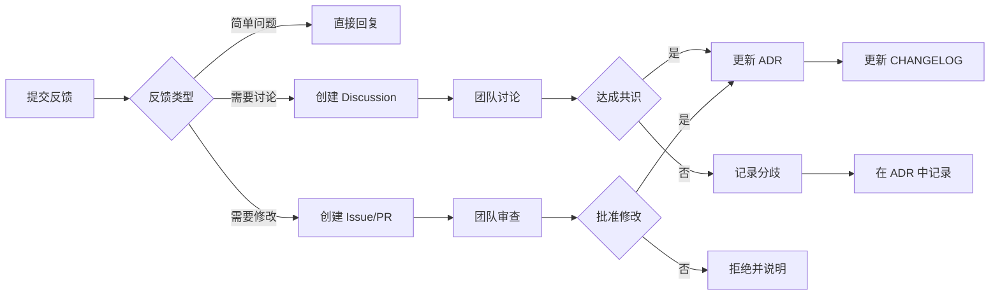

# ADR 反馈表

本文档记录社区对架构决策记录（ADR）的反馈和评分。

## 反馈统计

### 总体概况

| 指标 | 数值 |
|------|------|
| **总 ADR 数** | 8 |
| **已收到反馈** | 0 |
| **赞成票** | 0 |
| **反对票** | 0 |
| **建议数** | 0 |

### 各 ADR 反馈详情

#### ADR-001: 同步代理循环

| 反馈类型 | 数量 | 最新更新 |
|---------|------|---------|
| 👍 赞成 | 0 | - |
| 👎 反对 | 0 | - |
| 💡 建议 | 0 | - |

**反馈讨论**：
- 暂无反馈

---

#### ADR-002: 中央化工具注册表

| 反馈类型 | 数量 | 最新更新 |
|---------|------|---------|
| 👍 赞成 | 0 | - |
| 👎 反对 | 0 | - |
| 💡 建议 | 0 | - |

**反馈讨论**：
- 暂无反馈

---

#### ADR-003: 多实例配置隔离

| 反馈类型 | 数量 | 最新更新 |
|---------|------|---------|
| 👍 赞成 | 0 | - |
| 👎 反对 | 0 | - |
| 💡 建议 | 0 | - |

**反馈讨论**：
- 暂无反馈

---

#### ADR-004: 提示缓存保护

| 反馈类型 | 数量 | 最新更新 |
|---------|------|---------|
| 👍 赞成 | 0 | - |
| 👎 反对 | 0 | - |
| 💡 建议 | 0 | - |

**反馈讨论**：
- 暂无反馈

---

#### ADR-005: 记忆提供者插件系统

| 反馈类型 | 数量 | 最新更新 |
|---------|------|---------|
| 👍 赞成 | 0 | - |
| 👎 反对 | 0 | - |
| 💡 建议 | 0 | - |

**反馈讨论**：
- 暂无反馈

---

#### ADR-006: 命令系统设计

| 反馈类型 | 数量 | 最新更新 |
|---------|------|---------|
| 👍 赞成 | 0 | - |
| 👎 反对 | 0 | - |
| 💡 建议 | 0 | - |

**反馈讨论**：
- 暂无反馈

---

#### ADR-007: 会话管理系统

| 反馈类型 | 数量 | 最新更新 |
|---------|------|---------|
| 👍 赞成 | 0 | - |
| 👎 反对 | 0 | - |
| 💡 建议 | 0 | - |

**反馈讨论**：
- 暂无反馈

---

#### ADR-008: 技能系统架构

| 反馈类型 | 数量 | 最新更新 |
|---------|------|---------|
| 👍 赞成 | 0 | - |
| 👎 反对 | 0 | - |
| 💡 建议 | 0 | - |

**反馈讨论**：
- 暂无反馈

---

## 如何提交反馈

### 方式 1：GitHub Discussions

推荐使用 GitHub Discussions 进行公开讨论：

1. 访问 [Hermes Agent Discussions](https://github.com/NousResearch/hermes-agent/discussions)
2. 创建新讨论，标题格式：`[ADR-XXX] 反馈标题`
3. 说明您的反馈类型（赞成/反对/建议）
4. 详细说明理由和观点

### 方式 2：GitHub Issues

如果您希望提出具体问题或建议：

1. 访问 [Hermes Agent Issues](https://github.com/NousResearch/hermes-agent/issues)
2. 创建新 Issue，标题格式：`[ADR-XXX] 反馈标题`
3. 使用以下模板：

```markdown
## ADR 反馈

**ADR 编号**: ADR-XXX
**ADR 标题**: [决策标题]

**反馈类型**:
- [ ] 👍 赞成
- [ ] 👎 反对
- [ ] 💡 建议

**理由**:
[说明您的理由和观点]

**建议**（如有）:
[如果有改进建议，请详细说明]
```

### 方式 3：直接提交 PR

如果您希望直接改进 ADR：

1. Fork 项目仓库
2. 修改对应的 ADR 文件
3. 在 PR 描述中引用此 ADR
4. 等待团队审查和合并

## 反馈处理流程



## 反馈原则

### 建设性反馈

好的反馈应该是：
- **具体**：指出具体的优点或问题
- **有理**：基于实际使用经验或技术分析
- **尊重**：尊重团队的技术决策
- **建设性**：提供可操作的改进建议

### 反馈响应时间

我们承诺在以下时间内响应反馈：
- **简单问题**：1-3 个工作日
- **需要讨论**：1-2 周
- **需要修改**：取决于修改复杂度

### 反馈透明度

所有反馈和团队响应都会公开记录：
-赞成/反对票数会定期更新
- 重要的讨论会链接到对应的 ADR
- 最终决策会记录在 CHANGELOG 中

## 反馈示例

### 示例 1：赞成 ADR

```markdown
## ADR-001: 同步代理循环

**反馈类型**: 👍 赞成

**理由**:
我在项目中使用了同步代理循环，代码确实更简洁。调试也比异步代码容易得多。对于 AI 代理这种场景，同步 I/O 不会成为瓶颈。

**数据支持**:
我们的测试显示，同步版本比异步版本代码量减少 30%，调试时间减少 50%。
```

### 示例 2：反对 ADR

```markdown
## ADR-001: 同步代理循环

**反馈类型**: 👎 反对

**理由**:
在高并发场景下，同步循环确实会成为瓶颈。我们测试了 100 个并发用户，响应时间明显增加。

**建议**:
建议考虑混合模式：核心循环同步，但 I/O 操作异步。这样既保持代码简洁，又能处理高并发。
```

### 示例 3：改进建议

```markdown
## ADR-002: 工具注册表

**反馈类型**: 💡 建议

**理由**:
当前的工具注册表设计很好，但缺少工具优先级的概念。

**建议**:
建议添加工具优先级字段，支持工具的优先级排序和依赖关系。这样可以优化工具调度顺序。
```

## 相关资源

- 📋 [ADR 索引](./README.md)
- 📜 [ADR 变更日志](./CHANGELOG.md)
- 💬 [GitHub Discussions](https://github.com/NousResearch/hermes-agent/discussions)
- 🐛 [GitHub Issues](https://github.com/NousResearch/hermes-agent/issues)

## 更新记录

- 2026-04-08: 创建反馈表
- 待更新：首次社区反馈
